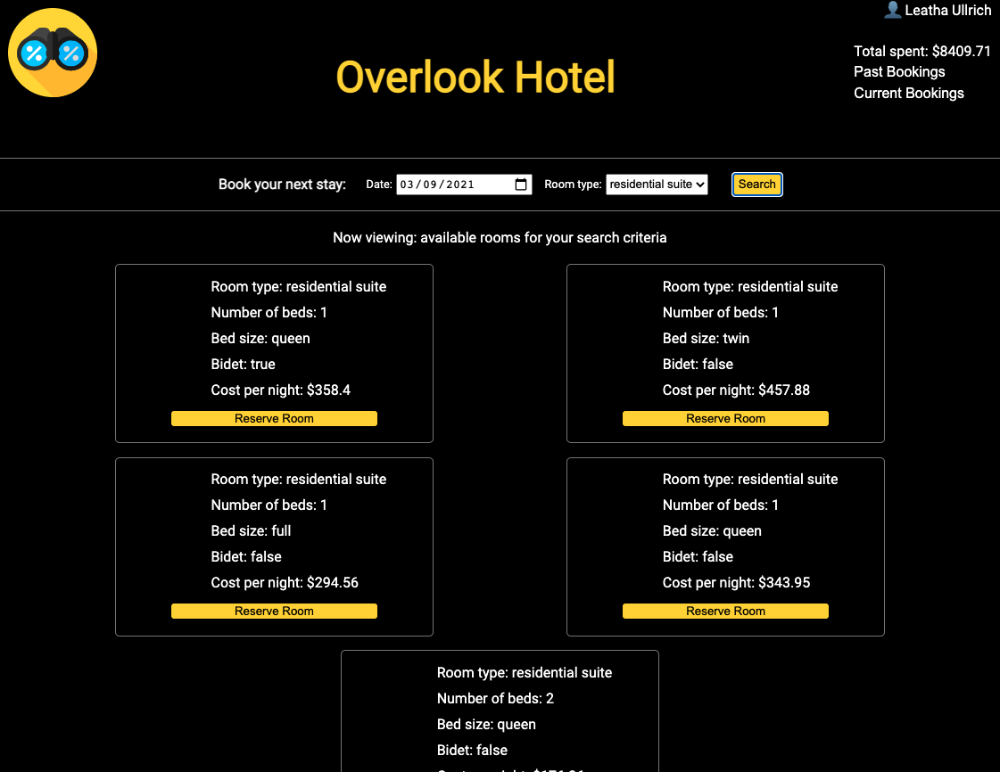
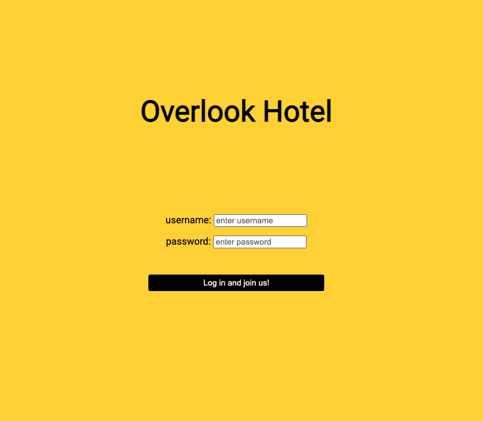
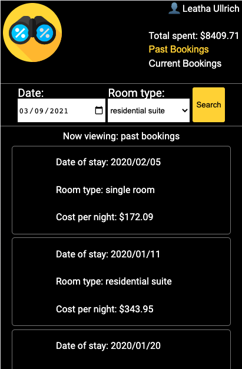

# Overlook

Overlook is the final solo Mod-2 project in the [Turing School of Software and Design](https://turing.io/). This application is intended to be a user dashboard for viewing, and booking, reservations at a ficitonal hotel. After logging in, a user is able to view their past and future reservations, as well as search for rooms by date and room type. 

[Original Project Specifications](https://frontend.turing.io/projects/overlook.html)

Learning goals and objects are as follows:

- Use OOP to drive the design of the application and the code
- Work with an API to send and receive data
- Solidify the code review process
- Create a robust test suite that thoroughly tests all functionality of a client-side application


## Desktop view of application


## Login page of application


## Mobile view of application



## Set Up (server and application must be running simultaneously)

### Overlook API Server

Clone down this repo: [FitLit API](https://github.com/turingschool-examples/overlook-api)

cd into directory and run:

```
npm install
```

To start the server, run:

```
npm start
```

### Overlook Application

Clone down this repository and install the library dependencies by running:

```
npm install
```

To start application, run:

```
npm start
```

If you see `Compiled successfully` in your terminal, the application is running and the app can be veiwed at `http://localhost:8080/` in your browser. Make sure this application, and the Overlook API server, are both running to ensure you see the right information displayed in the app.


## Contributors
##### Jeff Shepherd: [GitHub](https://github.com/JeffShepherd)


## Programming Languages and Technologies Used:
 

